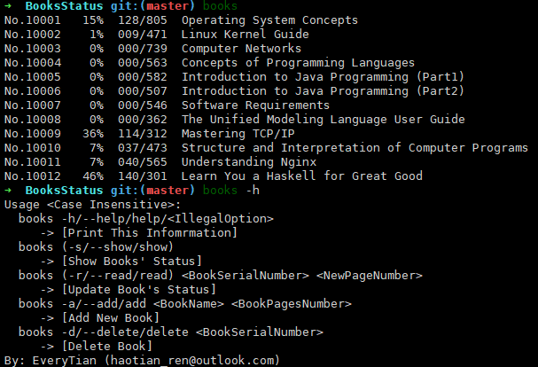
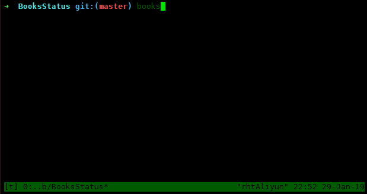

# BooksStatus

 

CLI 读书进度管理 / CLI Reading Progress Management

很久以前为了看纸质书随手写的自用程序，基于命令行的一个非常简陋的读书进度管理，修修补补支持了一下 Linux 和 Py2。

## Looks Like:



And here is a presentation:



## Installation

```shell
git clone https://github.com/EveryTian/BooksStatus.git
cd BooksStatus
python setup.py install
```

Yes, just use `python`, neither `python2` nor `python3`, just the default `python`. And also yes, please not use `pip install git+`.

Or you can download [install.cmd (https://raw.githubusercontent.com/EveryTian/BooksStatus/master/install.cmd)](https://raw.githubusercontent.com/EveryTian/BooksStatus/master/install.cmd) and execute it.

For example, on Linux:

```bash
curl https://raw.githubusercontent.com/EveryTian/BooksStatus/master/install.cmd | bash
```
